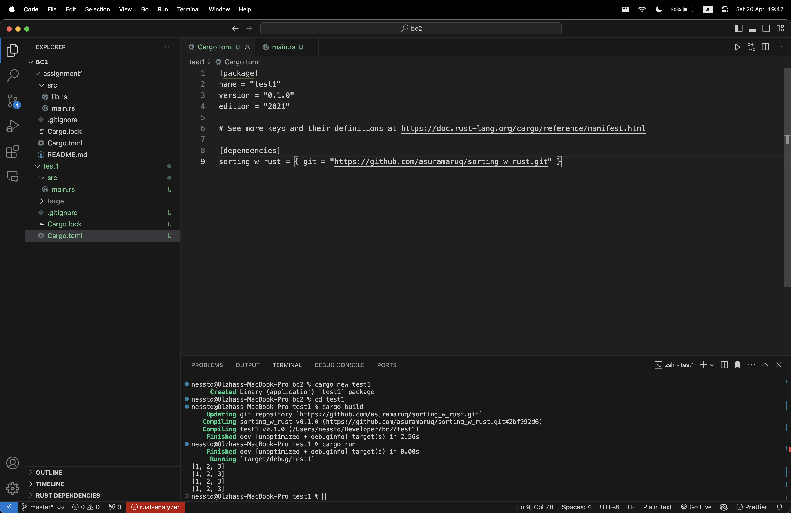
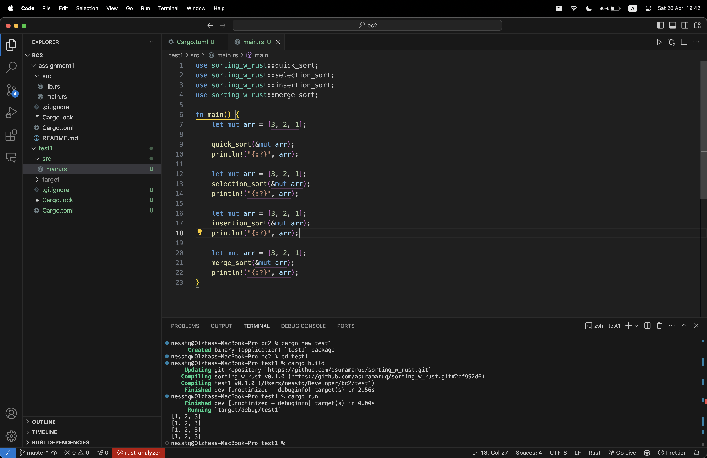
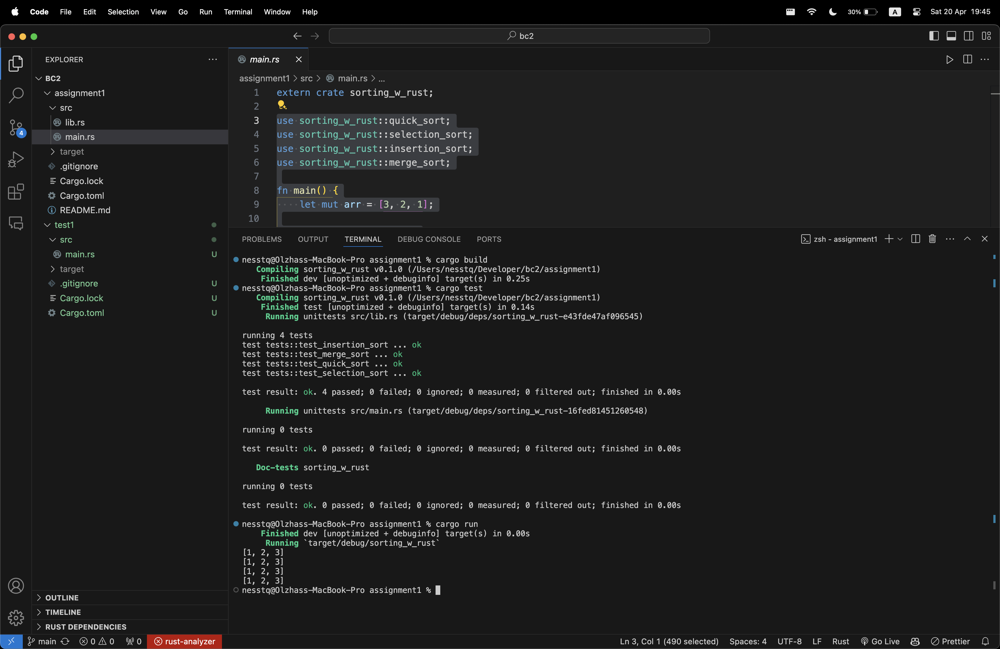

# Sorting Algorithms in Rust

This library provides implementations of various sorting algorithms in Rust, including quick sort, merge sort, insertion sort, and selection sort.

## Usage

### Add dependency



To use this library in your Rust project, add the following to your `Cargo.toml` file:

```toml
[dependencies]
sorting_w_rust = { git = "https://github.com/asuramaruq/sorting_w_rust.git" }
```

### Usage Example




```example
use sorting_w_rust::quick_sort;
use sorting_w_rust::selection_sort;
use sorting_w_rust::insertion_sort;
use sorting_w_rust::merge_sort;

fn main() {
    let mut arr = [3, 2, 1];

    quick_sort(&mut arr);
    println!("{:?}", arr);

    let mut arr = [3, 2, 1];
    selection_sort(&mut arr);
    println!("{:?}", arr);

    let mut arr = [3, 2, 1];
    insertion_sort(&mut arr);
    println!("{:?}", arr);

    let mut arr = [3, 2, 1];
    merge_sort(&mut arr);
    println!("{:?}", arr);
}
```

### Local Testing




